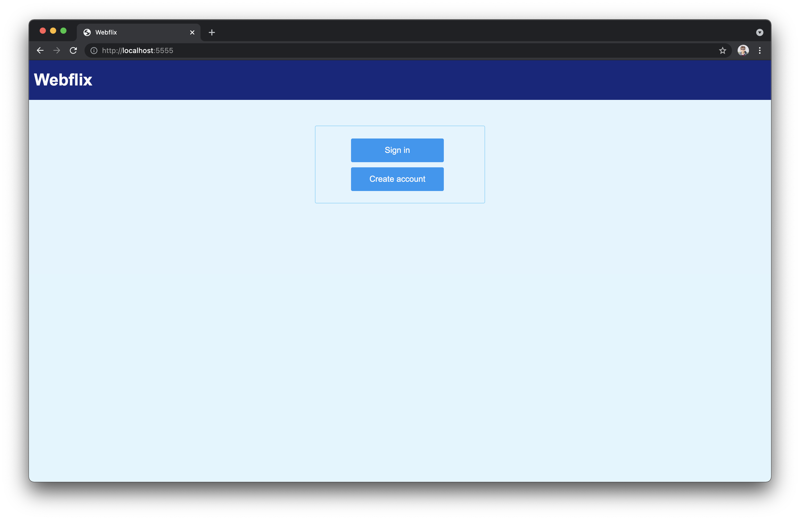
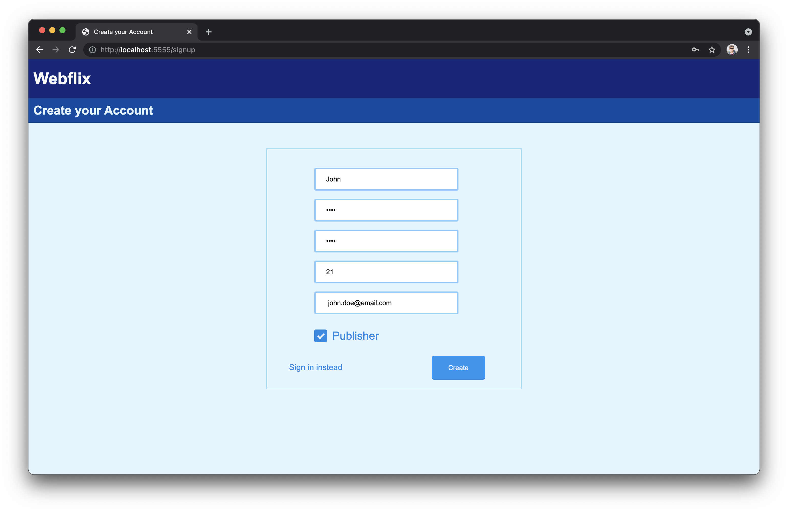
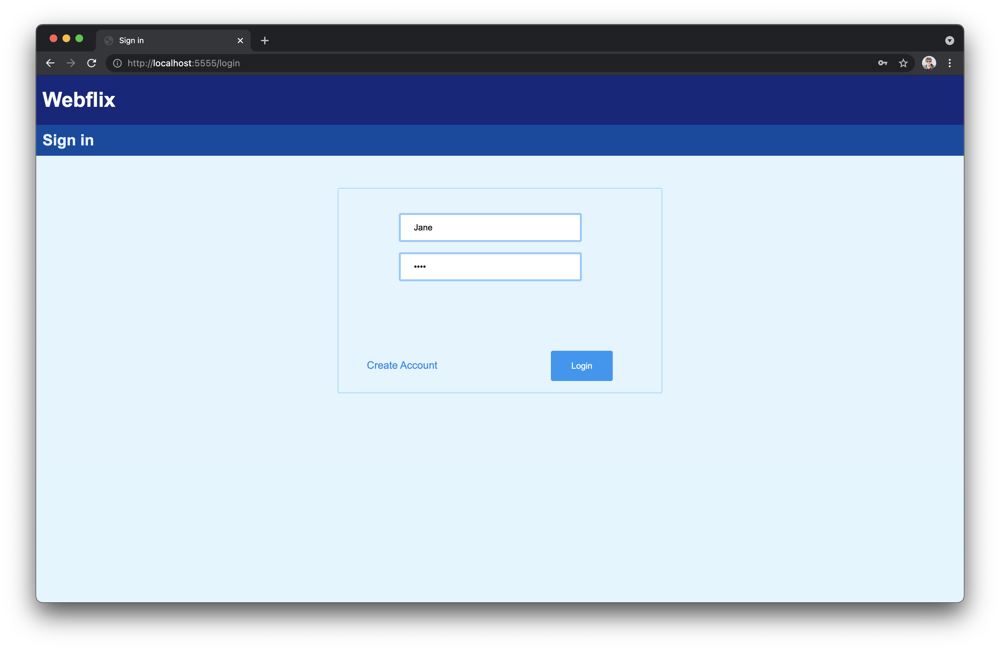
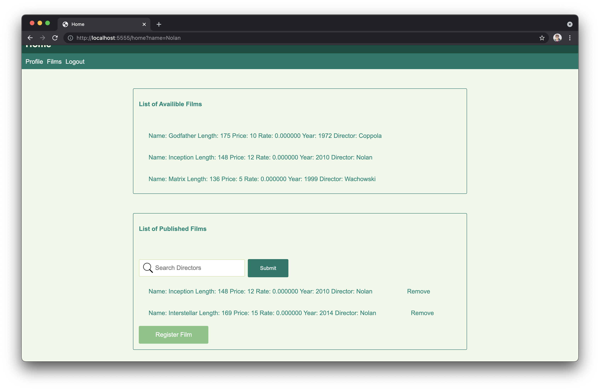
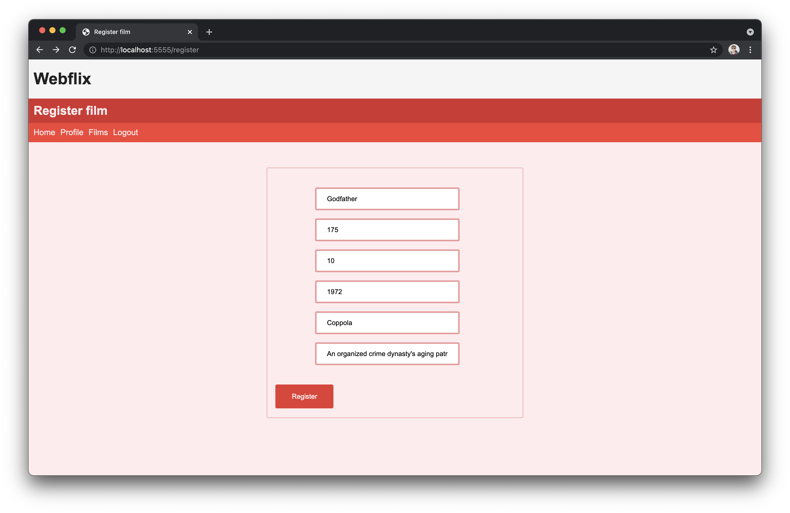
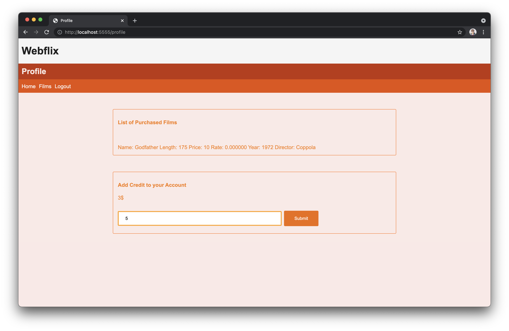
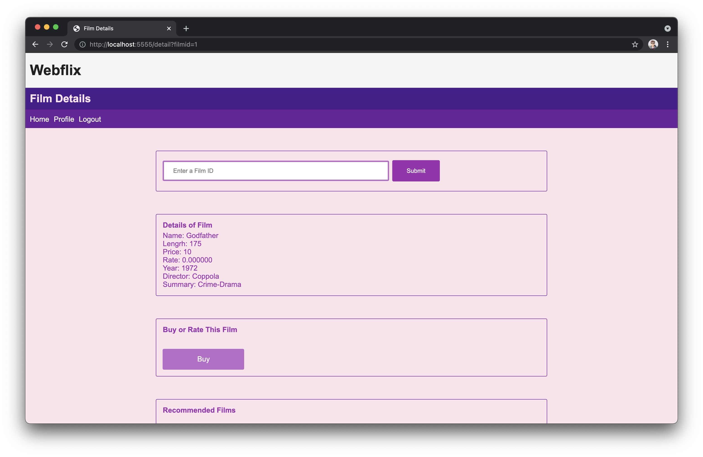

# Webflix - phase 3

## Webflix page

## Sign up page

On this page, people can register in the virtual network.

## Sign in page

The user on this page can log in by entering his username and password.

## Home page

The publisher can see the list of all the movies he has recorded by entering this page for the first time. Also, the publisher on this page can filter the list of films based on the director's name by entering it.

## Movie registration page

On this page, the publisher enters the information of a new movie and adds it to the screen.

## Profile page

On this page, the customer can see the list of movies he has purchased. The customer can also top up his account credit on this page.

## Movie information page

Each customer can view the details of a movie by entering this page.
At the end of this part, four movies from recommended movies will be screened after showing the details of the mentioned movie. By clicking on each of these movies, the customer is directed to the detail page of that movie. The customer can buy the movie on this page if they can afford it. Each customer can give the movie a 0 to 10 after purchasing it or adding a comment.

